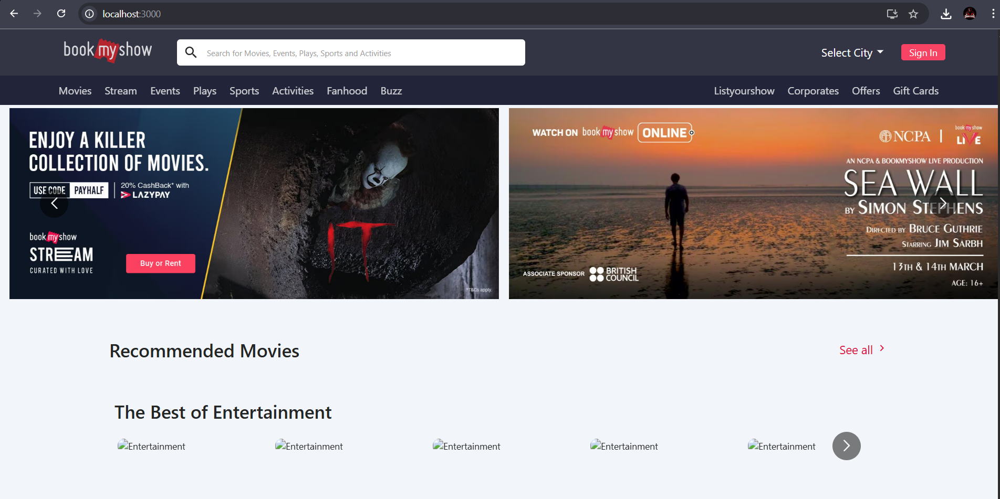

# 🎬 BookMyShow DevOps

A fully containerized, CI/CD-enabled version of a **Node.js-based BookMyShow clone**, built and deployed using **Jenkins**, **Docker**, and **Kubernetes (Minikube)** with integrated **SonarQube**, **Trivy**, and **OWASP Dependency-Check** for static & container security scanning.

---

## 🧱 Tech Stack

- 💻 Node.js 18
- 🐳 Docker
- ☸️ Kubernetes (via Minikube)
- 🧪 SonarQube (Code Quality)
- 🛡️ Trivy & OWASP Dependency-Check (Security)
- ⚙️ Jenkins (CI/CD)
- 🧠 GitHub (source version control)

---

## 🔁 Pipeline Workflow

1. ✅ Git checkout from GitHub (`main` branch)
2. 🔍 SonarQube static code analysis
3. 📦 Install dependencies
4. 🛡️ OWASP Dependency-Check & Trivy scan
5. 🐳 Docker build & push to DockerHub
6. ☸️ Deploy container to Kubernetes cluster (Minikube)

---

## 🚀 How to Run Locally

### 📦 Prerequisites

- Docker installed
- Jenkins installed (or use Jenkins container)
- Minikube installed (Docker driver recommended)
- Node.js & npm
- SonarQube running locally (optional)

---

### 🔧 1. Clone the Repo

```bash
git clone https://github.com/vanshrastogi111/BookMyShow-devops.git
cd BookMyShow-devops
```
### 🐳 2. Docker Build & Push (optional)
```bash
docker build -t vanshrastogi111/bms:latest .
docker push vanshrastogi111/bms:latest
```
### ☸️ 3. Start Minikube
```bash
minikube start --driver=docker
```
### ⚙️ 4. Configure Kubernetes Deployment
```bash
kubectl apply -f deployment.yml
kubectl apply -f service.yml
```
### 🌐 5. Access the App
Option A: NodePort
```bash
minikube ip
kubectl get svc bms-service
```
Then visit:

```php-template
http://<minikube-ip>:<nodePort>
```
Option B: Add host alias for pretty access
Edit /etc/hosts:
```
192.168.49.2  bookmyshow
```
Then:

```arduino
http://bookmyshow:<nodePort>
```
## 🛡️ Security & Code Quality Scans
This project integrates multiple scanning tools directly into the Jenkins pipeline to ensure a high standard of code quality and container security.

### 🧪 SonarQube Scan
Runs automatically in Jenkins:

```bash
sonar-scanner \
  -Dsonar.projectKey=BMS \
  -Dsonar.projectName=BMS
```
#### 🔧 Configured in Jenkins with:

SonarQube Server (Manage Jenkins > Configure System)

Token stored as sonar-token

Scanner tool name: sonar-scanner

### 🛡️ Trivy FS Scan
Scans your local project directory (source code + node_modules):

```bash
trivy fs .
```
🗂️ Report is saved as trivyfs.txt in the Jenkins workspace.

### 🧱 OWASP Dependency-Check
Scans all project dependencies and generates a full vulnerability report:

```bash
dependency-check --scan ./ --disableYarnAudit --disableNodeAudit
```
📊 Jenkins plugin publishes a report under the build summary tab.


## 🤖 Jenkins Configuration Notes
Docker credentials ID: docker-cred

SonarQube token ID: sonar-token

Jenkins tools:

JDK: jdk17

NodeJS: node23

Sonar Scanner: sonar-scanner

KUBECONFIG (for K8s):

```groovy
environment {
  KUBECONFIG = '/var/lib/jenkins/.kube/config'
}
```
## 🤝 Contribution
Feel free to fork and PR improvements!

### 🤝 **Connect with Me**

Let's connect and discuss DevOps!  

[](https://www.linkedin.com/in/-vansh-rastogi)  


